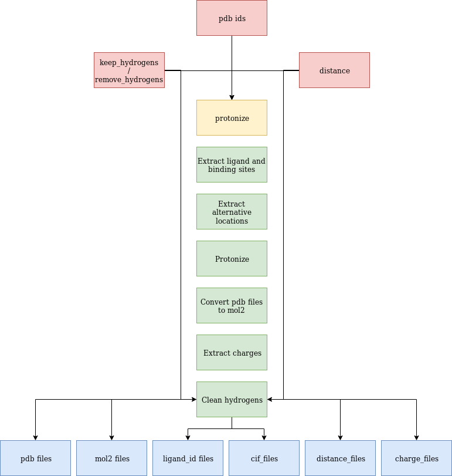

=====
Usage
=====

Importing promoe into your own project:
---------------------------------------
::

    import promoe

promoe's commandline interface:
-------------------------------

Promoe offers three not necessarily distinct entry points::

                 ____  ____   ___  __  __  ___  _____
                |  _ \|  _ \ / _ \|  \/  |/ _ \| ____|
                | |_) | |_) | | | | |\/| | | | |  _|
                |  __/|  _ <| |_| | |  | | |_| | |___
                |_|   |_| \_ \___/|_|  |_|\___/|_____|

Usage: promoe [OPTIONS] COMMAND [ARGS]...

Options:
  -v, --verbose  Verbose output (print debug statements)
  --help         Show this message and exit.

| Commands:
|   protonize
|   protonize-selected
|   clean-hydrogens

The help menus of the respective commands can be requested via::

    promoe <command> --help
    e.g. promoe protonize --help

promoe protonize
----------------

Help menu::

                |  _ \|  _ \ / _ \|  \/  |/ _ \| ____|
                | |_) | |_) | | | | |\/| | | | |  _|
                |  __/|  _ <| |_| | |  | | |_| | |___
                |_|   |_| \_ \___/|_|  |_|\___/|_____|

Usage: promoe protonize [OPTIONS]

Options:
  --pdbs TEXT                       pdb identifier to protonize -> binding site will be extracted automatically [required]
  --keep_hydrogens                  Specify if all hydrogens after protonization should be kept.
  --remove_hydrogens                Specify if hydrogens that are **not** within a specific distance should be deleted.
  --distance INTEGER                The maximal distance of the ligand to the surrounding water atoms after protonization, that should be kept. Default is 4. Hence, all water atoms within distance 4 to the ligand are not removed!
  --help                            Show this message and exit

| Multiple pdbs can be specified by repeating the --pdb parameter.
| The workflow is as follows:

